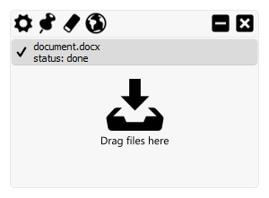

Link to Windows binary: [Kano.zip](https://github.com/MichaelSchreier/Kano/releases/download/v1.1.1/Kano.zip)

# Kano
Kano aims to make versioning and archiving files as simple as possible. Featuring a simplistic UI and relying only on folders and human readable text files for version tracking it is easy to use and transparent even to non tech-savvy end users.

### Where Kano shines
Kano takes absolutely zero time to set up and putting a copy of a file into an archive takes at most three mouse clicks - one if the file (e.g. an earlier version of it) has already been archived previously. This is including the mouse click for the drag & drop operation.
Kano's archiving system exlcusively relies on folders, human readable text files for the version history and of course the archived files as copies of the respective originals. This means that archives remain transparent to the user at all times and dropping Kano keeps archives fully intact and accessible to the users.

### What Kano is not
Kano is not intended to replace fully featured versioning solutions such as git, SVN, Mercurial and alike. If you need a professional versioning solution, want integrated text comparison (as in source code control) or sophisticated user management Kano is probably not for you.

### Usecases
+ Office-type scenarios where _versioning_ is typically done by adding an evergrowing number of suffixes to e.g. MS Office files (Business_Case.docx -> Business_Case_v1.docx -> ... -> (Copy of) Business_Case_v10_final_v2_edit.docx -> ...)
+ Working with art and other binary files that do not lend itself well to plain text based versioning tools - keep in mind though that as Kano uses full copies file size can be an issue
+ Working in environments with restrictive IT-policies - Kano does not need to be installed!

---
### Source dependencies
Kano is built on Python 3 as well the following libraries:
+ [PyQt5](https://www.riverbankcomputing.com/software/pyqt/download5) for the UI as well as some other features
+ [FuzzyWuzzy](https://github.com/seatgeek/fuzzywuzzy) for matching files and finding existing archives with slightly different names, e.g. *document_v1.docx* and *document_v2.docx* (needs to be turned on settings menu)
+ [Entypo+](http://www.entypo.com) for all UI icons
+ [PyYAML](http://pyyaml.org/wiki/PyYAML) for generating human readable archive history files
